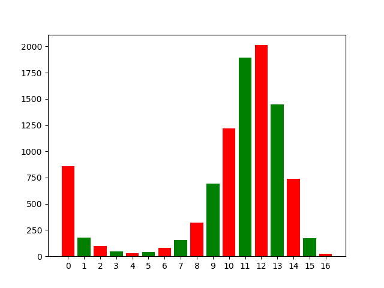

I was playing Mexican Train (game of dominoes) with my brother, and in the first round of the game you place a double domino down. Then, each player tries to create the longest chain of dominoes they can in an attempt to get rid of as many of their tiles as possible. This was probably the most stressful part of the game so I wrote a program that does it for me.

The algorithm is found in `Player.py` under the `longestPath` function; it is a simple recursive function. At each step, it checks to try to connect the last tile placed to a new one; if it can, it attempts to add another domino; if not, it goes on to check another tile. Once it is done checking every available tile, it returns the longest path it has found. These paths are bubbled up once the algorithm can no longer add dominoes to a chain.

I was also curious about the distribution of these path lengths because when playing, I noticed that I never seemed to only place a couple tiles in a chain: I could almost always either do nothing, or place nearly all my tiles down at once. In order to analyze this, I randomly generated ten-thousand sets of 16 tiles and then recorded the length of the longest chain each set could create. Sure enough, my suspicions were validated: placing down only a few tiles (between 1-8) was far less common than placing down nothing, or 9 or more. I haven't bothered to sit down and figure out the intuition for this based on the distribution of tiles in the deck, but I thought it was kinda neat.

It also justifies my righteous fury against the game: there is a very significant chance, through no fault of your own (being dealt a hand in which you can make no moves to start), that you will lose. Not being able to place in the first round is honestly infuriating. Mais c'est la vie...

